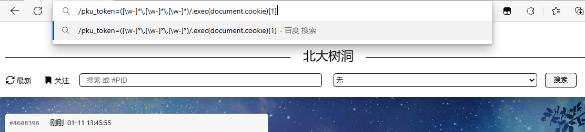
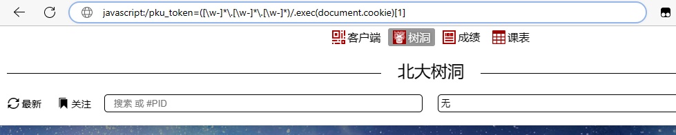
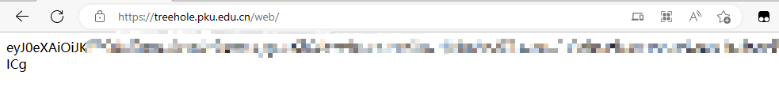

# 获取北大树洞 JWT

1. 前往[北大树洞](https://treehole.pku.edu.cn/)并登录
2. 在地址栏键入如下字符：

```
/pku_token=([\w-]*\.[\w-]*\.[\w-]*)/.exec(document.cookie)[1]
```



3. 在**开头手动加上** `javascript:` 几个字符，按回车确定。



> 不可以直接复制带 `javascript:` 的地址，大多数浏览器不允许这样做。

4. 此时页面上显示的就是北大树洞 JWT，粘贴到对应位置即可。


